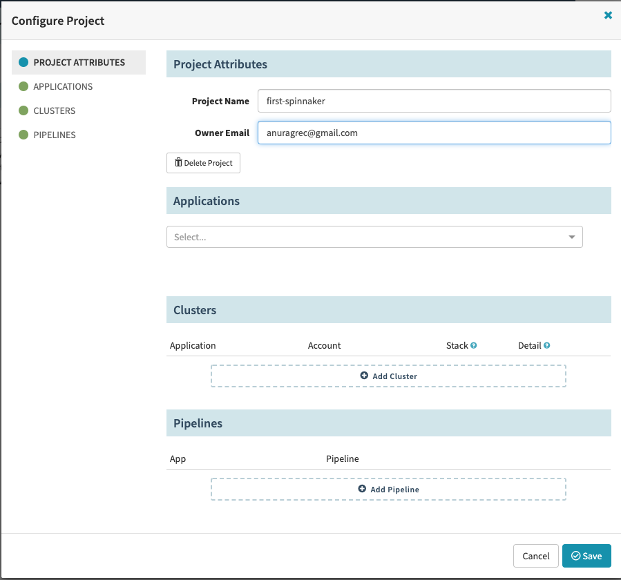
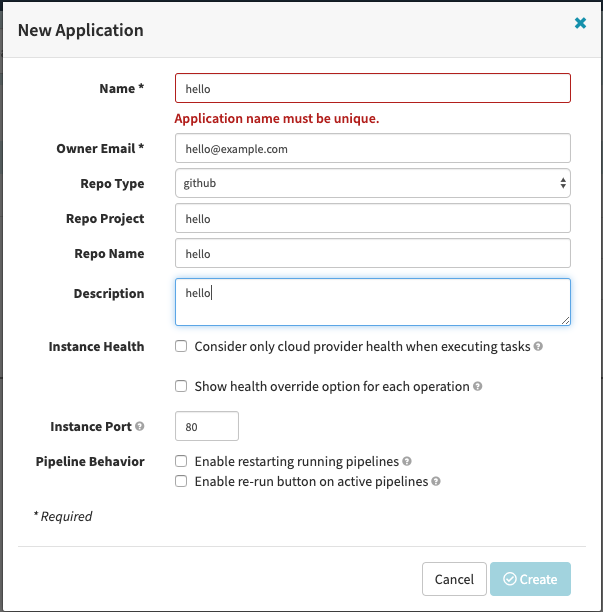
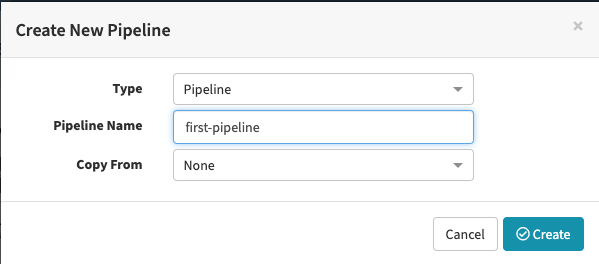
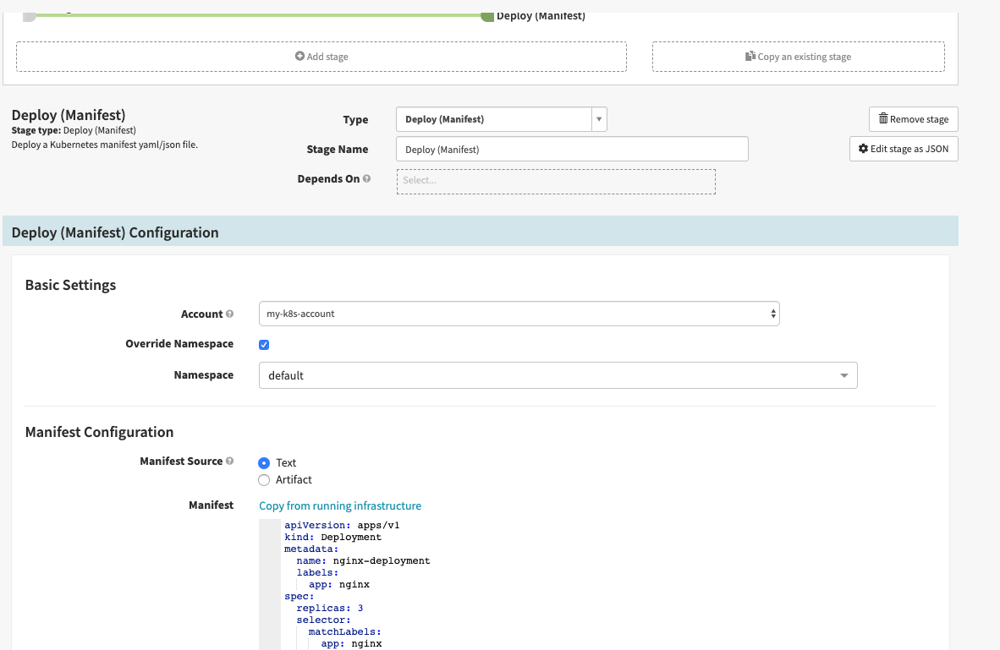
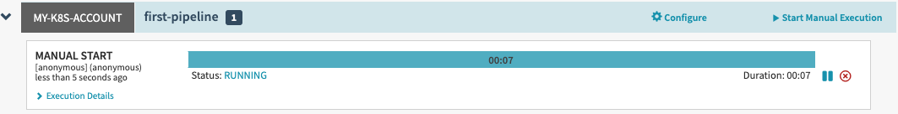
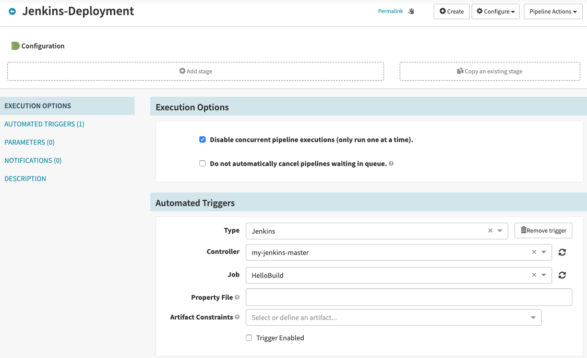
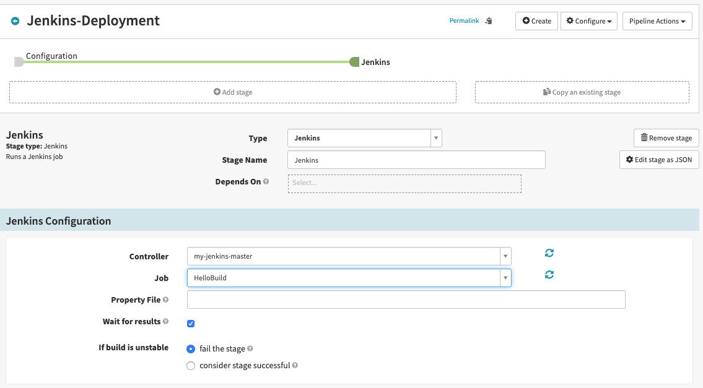

# Spinnaker setup

This reposiotry helps you setup spinnaker server

## Prerequisistes
- 4vCPU's
- 8GB RAM(minimum)
- 20GB HDD
- AWS Access Key and Secret Key
- AWS S3 Bucket
 
## Setup

The final environment include, 

1. Halyard (Tool to setup spinnaker)
2. Single-Node Kubernetes cluster
3. Jenkins Server (for CI) 

Please run the below script to install spinnaker on your system, it will prompt some required information for Spinnaker Halyard

```
bash spinnaker.sh
```

## Jenkins Setup

- While script is running, It's recommend to setup login credentails of Jenkins server as we're using CI as Jenkins server. 

- After basic setup, please enable API token with help `'https://stackoverflow.com/questions/45466090/how-to-get-the-api-token-for-jenkins`, and provide inputs to above script. 

- Configure Jenkins Server Global Secutiry to allow requests from spinnaker `https://www.spinnaker.io/guides/tutorials/codelabs/hello-deployment/#enable-jenkins-api` 

### Jenkins Build

Create a new jenkins build and configure. so that we can trigger from spinnaker. 

if you don't have any, you can use below details to configure your new jenkins job

- [Git code](https://github.com/angudadevops/Python-Developement)
- Add below steps in build step as Execute shell

```
    docker rm -f web db
    docker rmi -f myapp mysqldb
    cd /var/lib/jenkins/jobs/HelloBuild/workspace/flask/app
    docker build -t myapp . --no-cache
    cd /var/lib/jenkins/jobs/HelloBuild/workspace/flask/db
    docker build -t mysqldb . --no-cache
    docker images | egrep 'myapp|mysqldb'
    docker run -d -p 3306:3306 --name db mysqldb
    docker run -d -p 5000:5000 --name web --link db:db myapp
    echo "Access myapp application with $(hostname -I | awk '{print $1}'):5000"
```

Hope you're done with server setup, if you've any issues, please [create an issue](https://github.com/angudadevops/spinnaker/issues). we will help you

- Now it's time to explore spinnaker UI and do some real stuff

## Spinnaker Deployments

Once you're able to access your spinnaker server with localhost:9000, then follow the below steps to create some intersting stuff

### Simple Deployment from Spinnaker

- 

- Click the actions button 
  - 

- Select application 
  - 

-  and save changes

- 

You should see status as `SUCCEEDED`, if not please click on `Execution Details`. Verify from node, whether nginx deployment triggered or not. 

##### Ohoooo!!!! You made first deployment from spinnaker 

### Trigger Jenkins Pipeline

Now it's for create some standard deployment with Jenkins

- 

- 

- 

You can add multiple stage to each pipeline and start manual execution.

It's to explore spinnaker UI, recommended to explore all the componenets from UI and get an idea

## Some Useful Links

- [Spinnaker Architecture](https://www.spinnaker.io/reference/architecture/)
- [Quick Starts](https://www.spinnaker.io/setup/quickstart/)
- [Configure Everthing](https://www.spinnaker.io/setup/other_config/)
- [Core Concepts](https://www.spinnaker.io/concepts/)
